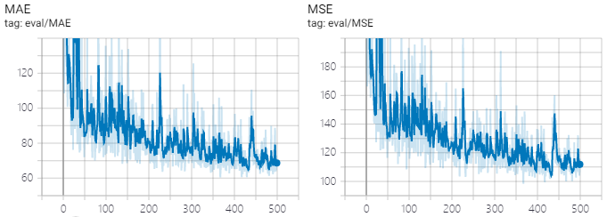

# SFANet-crowd-counting

This is an unofficial implement of the arXiv paper [Dual Path Multi-Scale Fusion Networks with Attention for Crowd Counting](https://arxiv.org/abs/1902.01115) by PyTorch. 

## Prerequisite

Python 3.7

Pytorch 1.1.0

## Code structure

`density_map.py` To generate the density map and attention map. 

`dataset.py` and `transforms.py` For data preprocess and augmentation. 

`models.py` The structure of the network. 

`train.py` To train the model. 

`eval.py` To test the model. 

## Train & Test

For training, run

`python train.py --dataset="SHA" --data_path="path to dataset" --save_path="path to save checkpoint"`

For testing, run

`python eval.py --dataset="SHA" --data_path="path to dataset" --save_path="path to checkpoint"`

## Result

ShanghaiTech part A: epoch367 MAE 60.43 MSE 98.24

ShanghaiTech part B: epoch432 MAE 6.38 MSE 10.99

